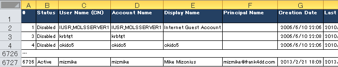
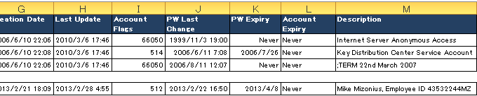

# Security

This repository contains security-related software.
http://fm4dd.com/security/

### check-console-defaults

[check-console-defaults](check-console-defaults): One potentially fatal mistake is to connect the server's management console (BMC) into an end-user reachable network, unconfigured and without further protection. It may sound incredible, but in a real-life case, several dozens of PRD servers turned out to be accessible that way.  This Perl script automates the large-scale identification of console ports running on vendor defaults.

<pre>D:\Code> check_console_defaults.pl 192.168.24 1 254
...
Checking 192.168.24.3... Host does not exist.
Checking 192.168.24.4... Host 192.168.24.4 alive... CIMC found! ...Default Login success!
Checking 192.168.24.5... Host 192.168.24.5 alive... CIMC found! ...Default Login success!
Checking 192.168.24.6... Host 192.168.24.6 alive... CIMC found! ...Default Login failed.
Checking 192.168.24.7... Host does not exist.
...</pre>

### check-ipmi-access

[check-ipmi-access](check-ipmi-access): The Intelligent Platform Management Interface (IPMI) is a set of computer interface specifications that provides management and monitoring capabilities independently of the host system. It is often embedded with a BMC (Baseboard Management Console, see above). Server vendors such as Cisco or HP had their respective BMC boards (CIMC and ILO) run the IPMI service by default, which listens on UDP port 623. In 2013, a number of vulnerabilities surfaced and turned IPMI into a risk that subsequently lead to it preferably disabled. This script looks for IPMI in a range of IP's as a quick way for verification and reporting. 

<pre>root@lts1604:/home/fm/sf_VM_Shared/code/Perl# ./check-ipmi-access.pl -f testiplist
Checking 192.168.12.125... Host 192.168.12.125 alive... No IPMI access... Error issuing Get Channel Authentication Capabilities request
Checking 192.168.12.131... Host 192.168.12.131 alive...  IPMI found... sel-output: Version : 1.5 (v1.5, v2 compliant)
Checking 192.168.12.154... Host 192.168.12.154 alive...  IPMI found... sel-output: Version : 1.5 (v1.5, v2 compliant)
Checking 192.168.12.164... Host 192.168.12.164 alive...  IPMI found... sel-output: Version : 1.5 (v1.5, v2 compliant)
Checking 192.168.12.26... Host 192.168.12.26 alive...  IPMI found... RAKP 2 message indicates an error : unauthorized name
...</pre>

### check-nfs-access

[check-nfs-access](check-nfs-access): NFS is still a common file sharing protocol for midrange UNIX systems. This script checks for world-readable file shares that may inadvertantly expose data. Although NFS is no longer a common protocol and shares would be unlikely visible to normal Wintel-based end users, it takes little effort to anyone looking with intent.

<pre>root@lts1604:/home/fm/sf_VM_Shared/code/Perl# ./check-nfs-access.pl -f testiplist 
Checking 192.168.30.130... Host 192.168.30.130 alive... NFS access denied.
Checking 192.168.30.130... Host 192.168.30.130 alive... share: /export/images (everyone) share: /export/spot (everyone)
Checking 192.168.30.131... Host 192.168.30.131 alive... share: /export/images (everyone) share: /export/spot (everyone)
Checking 192.168.30.139... Host 192.168.30.139 alive... share: /export/images (everyone) share: /export/spot (everyone)
Checking 192.168.34.242... Host 192.168.34.242 does not exist.
...</pre>

### check-snmp-access

[check-snmp-access](check-snmp-access): Many professional-grade infrastructure devices such as switches, printers, or video equipment implement the SNMP protocol for monitoring. Vendors often enable it by default for out-of-the-box functionality, using the SNMPv1 and v2c default community strings ("public"). For security conscious environments, this can be a problem since it aids adversaries through effortless information gathering. This Perl script automates the large-scale identification and verification, e.g. to confirm remediation efforts.

<pre>root@lts1604:/home/fm/sf_VM_Shared/code/Perl# ./check-snmp-access.pl -f testiplist
Checking 192.168.250.96... Host 192.168.250.96 alive... No SNMP access.
Checking 192.168.37.25... Host 192.168.37.25 alive... SNMP found... Descr: Product: GW 4 FXO;SW Version: 6.00A.037.003
Checking 192.168.37.37... Host 192.168.37.37 alive... SNMP found... Descr: IBM OS/400 V7R1M0
Checking 192.168.37.38... Host 192.168.37.38 alive... SNMP found... Descr: IBM OS/400 V7R1M0
Checking 192.168.37.39... Host 192.168.37.39 alive... SNMP found... Descr: IBM OS/400 V7R1M0
Checking 192.168.10.228... Host 192.168.10.228 does not exist.
... </pre>

### domain-userlist

[domain_userlist](domain_userlist): By default, Windows allows allows any domain user to retrieve full Windows Domain information about all users, groups, and other AD information. By scripting, we can obtain almost all information available in Active Directory. This Javascript program downloads the full list of Domain users, together with their password settings into a CSV file for easy user sorting. It works for acount extraction within the local domain and with trusted domains, common in larger environments.

### smbscan

[smbscan](smbscan): Windows file sharing is the most common way for file exchange between users in a office network. Security however usually is lost in everyday use. As a result, sensitive files get shared with everyone. This simple Java program can run anywhere to identify open file shares, and determines whats is behind them. The automation supports a quicker idenitifcation of security problems, and speeds up the lock down of sensitive information.

### Get-SymantecDefinitionDate

[symantec-def-date](symantec-def-date): There are situations were its crucial to know if the antivirus protection is in place, and to check that the configuration includes the exact virus signature that ensures protection from a specific threat. The Antivirus management tools can do that certainly, but in a outsourced world work goes to the cheapest place, which then turns out to be unable to do even simple tasks. Time again we are left with nothing else but our laptops, and this script does its job in a pinch.

<pre>D:\code\VB>cscript Get-SymantecDefinitionDate.vbs 10.253.28.102
Microsoft (R) Windows Script Host Version 5.8
Copyright (C) Microsoft Corporation. All rights reserved.

Host: 127.0.0.1 Symantec Endpoint Protection AV Pattern File Date: 2017-11-08 Revision: 6</pre>

### list-patches

[list-patches](list-patches): A VB script that lists up all installed patches (KB) on a Windows PC. The patches are ordered by installation date, and the CSV output can easily imported into Excel.

<pre>D:\code\VB>cscript list-patches.vbs
Microsoft (R) Windows Script Host Version 5.8
Copyright (C) Microsoft Corporation. All rights reserved.

Running list-patches.vbs
===================================================================
Installation Date, Computer, HotFix ID, Description, Installed By:
2018/04/20,PCAH86899,KB3138612,Update,NT AUTHORITY\SYSTEM
...
2018/05/08,PCAH86899,KB4093118,Security Update,NT AUTHORITY\SYSTEM</pre>

### Notes

See also http://fm4dd.com/security/
