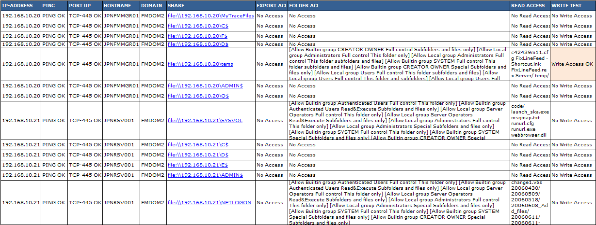

# Security

This repository contains security-related software.
http://fm4dd.com/security/

### check-console-defaults

[check-console-defaults](check-console-defaults): One potentially fatal mistake is to connect the server's management console into an end-user reachable network, unconfigured and without further protection. It may sound incredible, but in a real-life case, several dozens of PRD servers turned out to be accessible that way.  This Perl script automates the large-scale identification of console ports running on vendor defaults.

<pre>D:\Code> check_console_defaults.pl 192.168.24 1 254
...
Checking 192.168.24.3... Host does not exist.
Checking 192.168.24.4... Host 192.168.24.4 alive... CIMC found! ...Default Login success!
Checking 192.168.24.5... Host 192.168.24.5 alive... CIMC found! ...Default Login success!
Checking 192.168.24.6... Host 192.168.24.6 alive... CIMC found! ...Default Login failed.
Checking 192.168.24.7... Host does not exist.
...</pre>

### check-nfs-access

[check-nfs-access](check-nfs-access): NFS is still a common file sharing protocol for midrange UNIX systems. This script checks for world-readable file shares that may inadvertantly expose data. Although NFS is no longer a common protocol and shares would be unlikely visible to normal Wintel-based end users, it takes little effort to anyone looking with intent.

<pre>root@lts1604:/home/fm/sf_VM_Shared/code/Perl# ./check-nfs-access.pl -f testiplist 
Checking 192.168.30.130... Host 192.168.30.130 alive...  share: /export/images (everyone) share: /export/spot (everyone)
Checking 192.168.30.131... Host 192.168.30.131 alive...  share: /export/images (everyone) share: /export/spot (everyone)
Checking 192.168.30.139... Host 192.168.30.139 alive...  share: /export/images (everyone) share: /export/spot (everyone)
Checking 192.168.34.242... Host 192.168.34.242 does not exist.
...</pre>

### domain-userlist

[domain_userlist](domain_userlist): By default, Windows allows allows any domain user to retrieve full Windows Domain information about all users, groups, and other AD information. By scripting, we can obtain almost all information available in Active Directory. This Javascript program downloads the full list of Domain users, together with their password settings into a CSV file for easy user sorting. It works for acount extraction within the local domain and with trusted domains, common in larger environments.

### smbscan

[smbscan](smbscan): Windows file sharing is the most common way for file exchange between users in a office network. Security however usually is lost in everyday use. As a result, sensitive files get shared with everyone. This simple Java program can run anywhere to identify open file shares, and determines whats is behind them. The automation supports a quicker idenitifcation of security problems, and speeds up the lock down of sensitive information.

### Notes

See also http://fm4dd.com/security/
