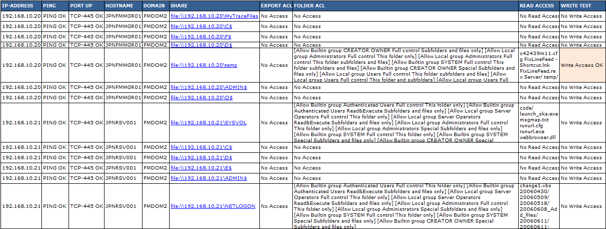

# smbscan

## Man page for the smbscan tool

Copyright (c) 2015 Frank4DD<support[at]frank4dd.com>

### smbscan

* * *

This program checks for reachable Windows network shares on networked systems. In most cases, access to shares should be restricted, and general access shouldn't be allowed unless the data is public.

The smbscan Java program uses the jcifs Java libary (https://jcifs.samba.org/) for the low-level SMB functions. It can run a check for hosts in network ranges up to class-C (e.g. x.y.z.1-254) by counting up the last octet.

Smbscan first checks if hosts are pingeable, and then tries to connect via tcp port 445. If successful, it lists up reachable shares together with directories if they are readable. Results are written into a file, the Optional parameter csv formatsthe output for easy import into MS Excel.

#### Usage:

`java -classpath [path to jcifs.jar and smbscan.class] smbscan [domain] [domain-user] [password] [network] [start-ip] [end-ip]`  

`java -classpath [path to jcifs.jar and smbscan.class] smbscan [domain] [domain-user] [password] [network] [start-ip] [end-ip] [csv]`  

`java -classpath [path to jcifs.jar and smbscan.class] smbscan [domain] [domain-user] [password] [network] [start-ip] [end-ip] [csv] [wt]`  

#### Options:

[domain]  
      The Windows domain name

[domain-user]  
      The domain-user for running the check with an authenticated user.

[password]  
      The password for the domain-user

[network]  
      The first three octets of a IP address, e.g. 192.168.1.

[start-ip]   
      The first host to check. the program will add this number it to the network octets to start the loop. "1" will translate together with the network 192.168.1 to 192.168.1.1 as the first IP to be checked.

[end-ip]  
      The last host to check. The program adds this number to the network octets to stop the loop. "254" will  translate together with the network 192.168.1 to 192.168.1.254 as the last IP to be checked.

[csv]  
      Optional - this parameter formats the output as csv, and the resulting list can be viewed easily with MS Excel. If ot present, the output file will be a plaintext logfile.

[wt]  
      Optional - this parameter enables the write test. If ot present, the program tries to write a temporary test file into the share, and deletes it afterwards. 

#### Usage Example:

Running the program:

<pre>root@lts1404:/home/fm # java -cp .:../dist/jcifs.jar smbscan FMDOM2 frank4dd mypass 192.168.10 20 22 csv wt
Received arg csv - Using CSV format with separator: ,
Received arg wt - Adding write tests.
TEST: 192.168.10.20 Ping: OK TCP-445: OK NAME: JPNFMMGR01 DOMAIN: FMDOM2 SHARE: MyTraceFiles EXPORT: No Access FOLDER: No Access READ: No Read Access WRITE: test1450080472113.txt No Write Access
 SHARE: C$ EXPORT: No Access FOLDER: No Access READ: No Read Access WRITE: test1450080472388.txt No Write Access
 SHARE: F$ EXPORT: No Access FOLDER: No Access READ: No Read Access WRITE: test1450080473100.txt No Write Access
 SHARE: D$ EXPORT: No Access FOLDER: No Access READ: No Read Access WRITE: test1450080473359.txt No Write Access
 SHARE: temp EXPORT: No Access FOLDER: analyzed 10 ACE READ: checked 5/5 share entries WRITE: test1450080474636.txt Write Access OK
 SHARE: ADMIN$ EXPORT: No Access FOLDER: No Access READ: No Read Access WRITE: test1450080474854.txt No Write Access
 SHARE: Q$ EXPORT: No Access FOLDER: No Access READ: No Read Access WRITE: test1450080475274.txt No Write Access
TEST: 192.168.10.21 Ping: OK TCP-445: OK NAME: JPNRSV001 DOMAIN: FMDOM2 SHARE: SYSVOL EXPORT: No Access FOLDER: analyzed 9 ACE READ: checked 5/6 share entries WRITE: test1450080475690.txt No Write Access
 SHARE: C$ EXPORT: No Access FOLDER: No Access READ: No Read Access WRITE: test1450080475978.txt No Write Access
 SHARE: D$ EXPORT: No Access FOLDER: No Access READ: No Read Access WRITE: test1450080476166.txt No Write Access
 SHARE: E$ EXPORT: No Access FOLDER: No Access READ: No Read Access WRITE: test1450080476336.txt No Write Access
 SHARE: ADMIN$ EXPORT: No Access FOLDER: No Access READ: No Read Access WRITE: test1450080476604.txt No Write Access
 SHARE: NETLOGON EXPORT: No Access FOLDER: analyzed 9 ACE READ: checked 5/173 share entries WRITE: test1450080477023.txt No Write Access</pre>

#### Output Example:

The results file shown in Excel:

#### Notes:

The pprogram's .java source code file needs to be compiled into Java bytecode before it can be used, i.e. by calling:  _javac -cp .:../dist/jcifs.jar smbscan.java_.
